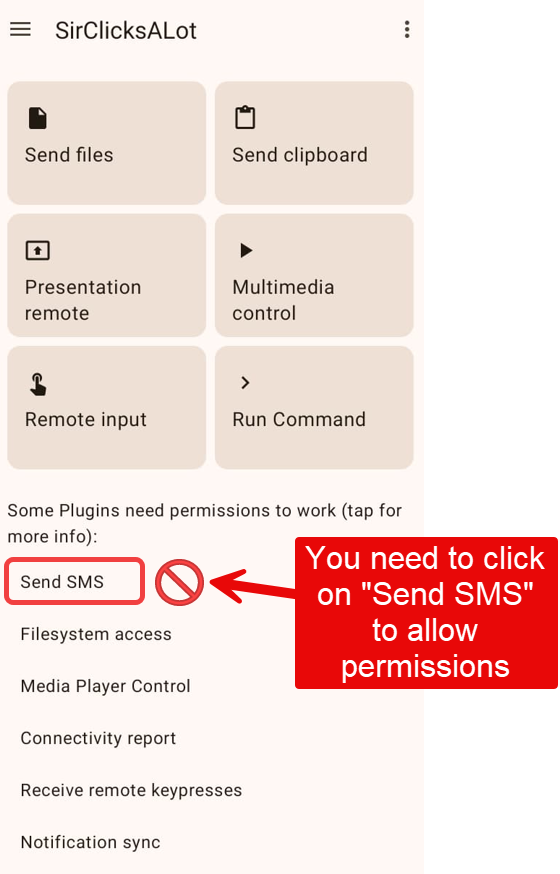

# How to view your invoices?

If you'd like to view and download your invoices, here's how to do it in a few quick steps.

#### Step 1 – Access your account

Go to:\
[https://pythonandvba.com/account-login/](https://pythonandvba.com/account-login/)

Enter the **product name** and your **license key**.\
You’ll get a secure login link by email.

#### Step 2 – Go to the Invoice tab

Once logged in, click on **Invoice** in the left menu.

<figure><figcaption></figcaption></figure>

#### Step 3 – View your invoice

You’ll see your invoices listed.

1. Find the one you want to view.
2. Click in the invoice number.
3. View/Download your invoice.


**NOTE:** If you need more details on your invoice (company name, address, VAT number, etc.), send me an email at **contact@pythonandvba.com** and I’ll update it for you.

