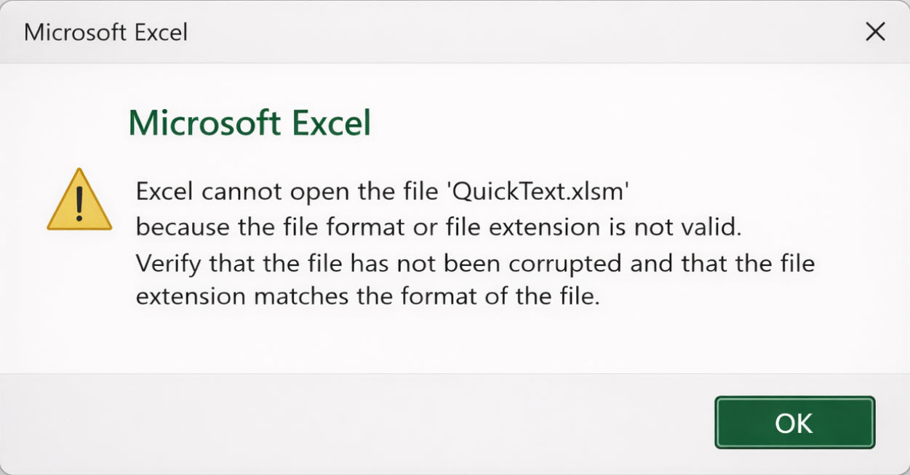

# Page

### Problem

When opening QuickText, Excel shows this message:

### Why this happens

In almost all cases, this is **caused by antivirus software**.

QuickText is a macro-enabled Excel file.\
It uses VBA macros and runs small background scripts to send SMS.

Some antivirus tools block or modify files that automate tasks.\
When this happens, parts of the VBA project may be removed.

Once that happens, Excel sees the file as corrupted and refuses to open it.

### How to fix it

1. Open your antivirus dashboard
2. Check Quarantine or History
3. Restore QuickText if it appears and mark it as allowed
4. Add an exception for the QuickText folder
5. Temporarily disable the antivirus
6. Download a fresh copy of QuickText
7. Open the file only after the exception is in place


**Important:** If a file was quarantined or modified, it cannot be fixed. You must **download a fresh copy** after allowing it in your antivirus.


If you want a deeper explanation, see this page: [antivirus-or-firewall-warning-false-positive.md](antivirus-or-firewall-warning-false-positive.md "mention") 
