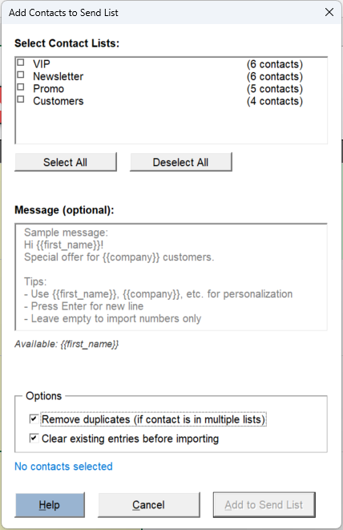

# KDE Connect CLI Not Recognized

If you run this command in your Command Prompt:

```batch
%comspec% /c set LANG=en_US.UTF-8 && kdeconnect-cli --list-devices > %TEMP%\test.txt && type %TEMP%\test.txt
```

And you receive this error:

`'kdeconnect-cli' is not recognized as an internal or external command, operable program or batch file`

Follow these troubleshooting steps:

### Step 1: Check App Execution Aliases

Windows Store apps use execution aliases that need to be enabled.

1. Open **Settings**
2. Navigate to **Apps** → **Advanced app settings** → **App execution aliases**
3. Scroll down and find **KDE Connect**
4. Ensure the toggle is **ON** (enabled)

<figure><figcaption></figcaption></figure>

### Step 2: Verify KDE Connect CLI File Exists

Check if the kdeconnect-cli.exe file is present in the WindowsApps folder.

1. Open Command Prompt or PowerShell
2. Run the following command:

```batch
dir "%LOCALAPPDATA%\Microsoft\WindowsApps\kdeconnect-cli.exe"
```

3. If the file is found, proceed to Step 3
4. If the file is **not found**, you may need to reinstall KDE Connect from the Microsoft Store

<figure><figcaption></figcaption></figure>

### Step 3: Add WindowsApps to Environment Variables

Ensure the WindowsApps folder is added to your system PATH.

1. Press **Win + R**, type `sysdm.cpl`, and press **Enter**
2. Click the **Advanced** tab
3. Click the **Environment Variables** button
4. Under **User variables for \<username>**, find and select **Path**
5. Click **Edit**
6. Check if the following path already exists:

```
%USERPROFILE%\AppData\Local\Microsoft\WindowsApps
```

7. If it doesn't exist, click **New** and add the path
8. Click **OK** on all dialogs to save changes

### Step 4: Restart Your Computer

A system restart is required for PATH changes to take effect.

1. Save all your work
2. Restart your computer

### Step 5: Verify the Fix

After restarting, open a **new** Command Prompt window and run the test command again:

```
%comspec% /c set LANG=en_US.UTF-8 && kdeconnect-cli --list-devices > %TEMP%\test.txt && type %TEMP%\test.txt
```

If successful, you should see a list of your connected KDE Connect devices (or an empty list if no devices are connected).

### Still Not Working?

If you've followed all steps and the command still doesn't work, try reinstalling KDE Connect:

#### Uninstall the Windows Store Version

1. Click the **Start** button or press the **Windows key**
2. Type **KDE Connect** in the search bar
3. Right-click on **KDE Connect** in the search results
4. Select **Uninstall**
5. Confirm the uninstallation

#### Install the Desktop Version

1. Go to [kdeconnect.kde.org/download.html](https://kdeconnect.kde.org/download.html)
2. Download the Windows installer
3. Run the installer and follow the installation steps
4. **Restart your computer**

#### Add KDE Connect to Environment Variables

After installing the desktop version, you need to add it to your PATH:

1. Press **Win + R**, type `sysdm.cpl`, and press **Enter**
2. Click the **Advanced** tab
3. Click the **Environment Variables** button
4. Under **User variables for \<username>**, find and select **Path**
5. Click **Edit**
6. Click **New**
7. Add the path: C:\Program Files\KDE Connect\bin
8. Click **OK** on all dialogs to save changes
9. **Restart your computer** again

#### Verify the Fix

After restarting, open a **new** Command Prompt window and run the test command again:

```
%comspec% /c set LANG=en_US.UTF-8 && kdeconnect-cli --list-devices > %TEMP%\test.txt && type %TEMP%\test.txt
```

If successful, you should see a list of your connected KDE Connect devices (or an empty list if no devices are connected).

