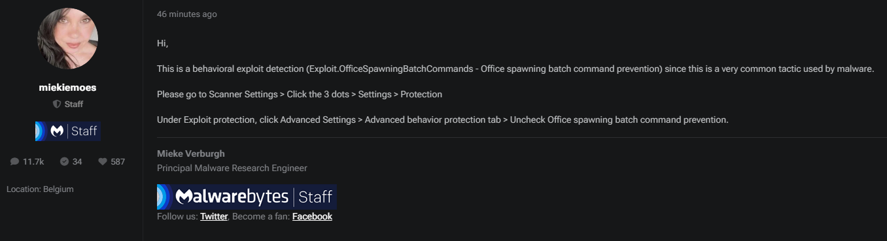

# Malwarebytes blocking QuickText

If you use Malwarebytes, Excel may close when you run QuickText, with no error or warning. This happens because of a Malwarebytes feature called “Office spawning batch command prevention.” QuickText uses PowerShell to send messages, which triggers this setting.

### Here’s how to fix it:

1. **Open Malwarebytes**\
   Start Malwarebytes from your Start menu or taskbar.
2.  Go to Scanner Settings > Click the 3 dots > **Settings** > **Protection**\
    Under Exploit protection, click **Advanced Settings** 

    <figure><figcaption></figcaption></figure>
3.  Under the "**Advanced behavior protection tab**" , uncheck "**Office spawning batch command prevention**" 

    <figure><figcaption></figcaption></figure>
4. **Save and Restart Excel**\
   Click OK or Save.\
   Close Excel completely, then open your QuickText file again.

***

### Reference

Malwarebytes officially confirms this as the solution.\
[Malwarebytes Forum Post](https://forums.malwarebytes.com/topic/331574-false-positive-report-for-excel-tool-quicktext/)

<figure><figcaption></figcaption></figure>
