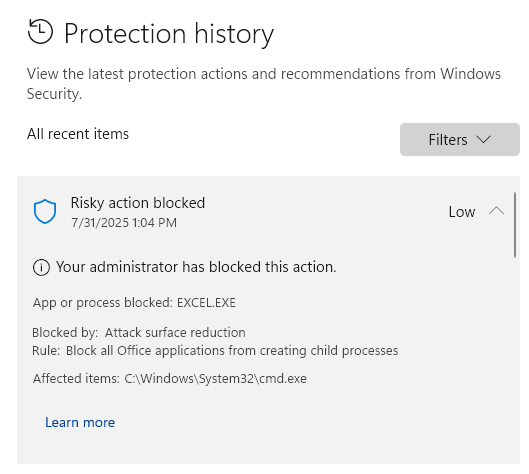

# Windows Defender Blocking QuickText (ASR Rule)

If you see this message from Windows Security:

<div align="left"><figure><figcaption></figcaption></figure></div>

**What’s going on?**\
Windows Defender has a security rule (“Attack surface reduction”) that blocks Excel from running background commands. This stops QuickText from sending SMS.

**How to fix it:**\
You have two options:

**Option 1: Enable “Bypass ASR” in QuickText (quick fix)**

* Open QuickText
* Go to Settings > Advanced Settings
* Set “Bypass ASR” to **Enabled**
* Save the settings

<div align="left"><figure><figcaption></figcaption></figure></div>


_Note: This option is the quickest and doesn’t require changing your Windows security settings. However, it may add a small delay (a few seconds) each time you send an SMS._


**Option 2: Disable the Defender Rule (permanent fix for admins)**\
If you have admin rights, you can turn off just this security rule:

* Open PowerShell **as administrator**
*   Run this command:

    ```
    Set-MpPreference -AttackSurfaceReductionRules_Ids D4F940AB-401B-4EFC-AADC-AD5F3C50688A -AttackSurfaceReductionRules_Actions Disabled
    ```

<figure><figcaption></figcaption></figure>

_This will remove the block and allow QuickText to send SMS without any added delay._
